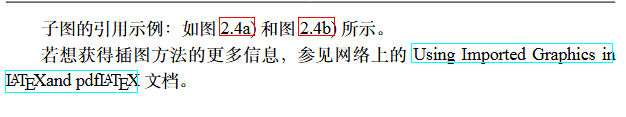
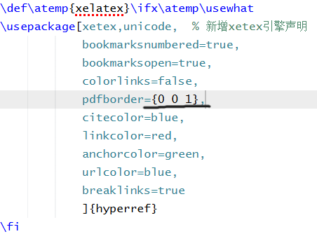

# 📄 海南大学2026届本科毕业论文LaTeX模板

## 🌟 项目来历
本LaTeX论文模板继承并发展自2014级孙浩然学长的优秀工作，其最初版本参考了天津大学及山东大学软件工程学院的格式规范。  

为适配最新要求，我对模板进行了全面审阅与修订，使其严格符合海南大学2026届本科毕业生的论文格式标准。  

使用前建议具备LaTeX基础操作知识，以提升撰写效率。由于个人能力有限，模板可能存在疏漏，欢迎各位同学提出改进建议，更期待海南大学的LaTeX爱好者加入维护队伍，共同完善模板，惠及更多学子。  

📧 联系作者：aa.chen.yun823@gmail.com（疑问咨询或加入维护团队均可）

## 📝 使用说明
### 方法一（推荐）
1. 打开Overleaf平台，搜索 **「LaTeX模板|2026海南大学本科毕业论文」**  
2. 直接选择本项目即可开始使用  

### 方法二
1. 下载本项目所有文件  
2. 登录Overleaf，创建 **blank project**（空白项目）  
3. 将下载的文件上传至该空白项目  

### 通用要求
上述两种方法均需在Overleaf的 **Menu** 中选择 **Xelatex** 作为编译方式  

### 方法三（不推荐）
- 可尝试本地LaTeX编译器编译  
- 仅限熟练掌握LaTeX的用户尝试，本项目未对本地环境做适配测试  

## 📌 补充说明
### 🖼️ 问题现象
PDF 生成后，超链接周围会显示红框，影响文档美观，具体效果如下：  

### 🔧 解决方案
若需取消该红框，可参考下图中黑色线标注的代码片段，将原有参数 `[0 0 1]` 修改为 `[0 0 0]` 即可消除红框：  

## ⚠️ 免责声明
本模板仅为海南大学2026届本科毕业论文格式的参考工具，不代表学校官方发布版本。  
使用时请务必结合学校最新通知及院系具体要求进行调整，作者不对因模板使用导致的格式问题承担责任。  
请使用者自行核对最终论文格式的合规性。
